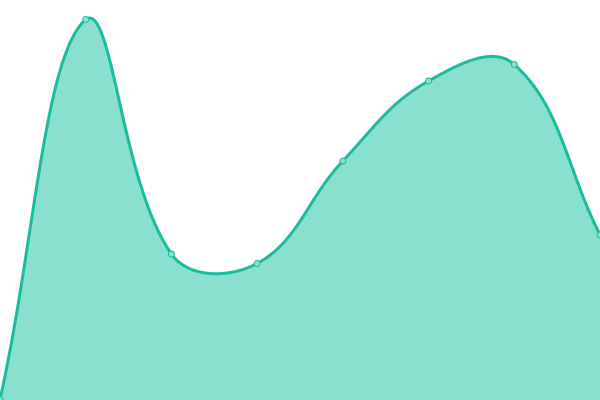
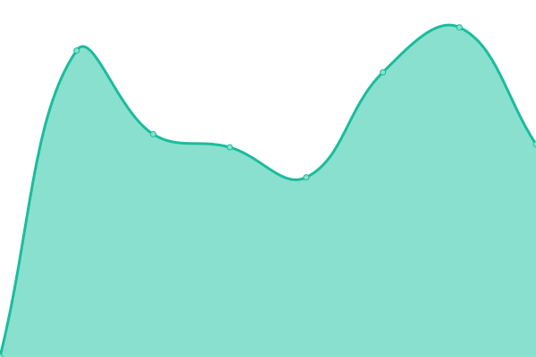
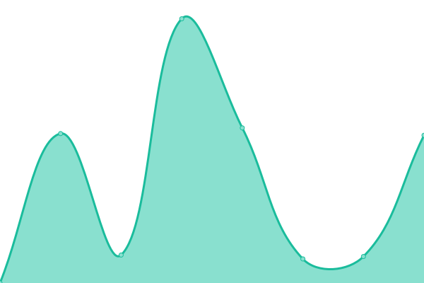

# [📈 Live Status](https://demo.upptime.js.org): <!--live status--> **🟧 Partial outage**

This repository contains the open-source uptime monitor and status page for [Upptime](https://upptime.js.org), powered by [Upptime](https://github.com/upptime/upptime).

With [Upptime](https://upptime.js.org), you can get your own unlimited and free uptime monitor and status page, powered entirely by a GitHub repository. We use [Issues](https://github.com/upptime/upptime/issues) as incident reports, [Actions](https://github.com/matiasdelellis/upptime/actions) as uptime monitors, and [Pages](https://demo.upptime.js.org) for the status page.

<!--start: status pages-->
<!-- This summary is generated by Upptime (https://github.com/upptime/upptime) -->
<!-- Do not edit this manually, your changes will be overwritten -->
<!-- prettier-ignore -->
| URL | Status | History | Response Time | Uptime |
| --- | ------ | ------- | ------------- | ------ |
|  [Nextcloud](https://delellis.com.ar) | 🟩 Up | [nextcloud.yml](https://github.com/matiasdelellis/upptime/commits/HEAD/history/nextcloud.yml) | 

 1440ms
     
 | 

<a href="https://matiasdelellis.github.io/upptime/history/nextcloud">95.49%</a>
    

|  [Servicios](https://services.delellis.com.ar) | 🟩 Up | [servicios.yml](https://github.com/matiasdelellis/upptime/commits/HEAD/history/servicios.yml) | 

 337ms
     
 | 

<a href="https://matiasdelellis.github.io/upptime/history/servicios">100.00%</a>
    

|  [Correo](https://mail.delellis.com.ar) | 🟩 Up | [correo.yml](https://github.com/matiasdelellis/upptime/commits/HEAD/history/correo.yml) | 

 311ms
     
 | 

<a href="https://matiasdelellis.github.io/upptime/history/correo">100.00%</a>
    

|  [collabora/code](https://office.delellis.com.ar/health) | 🟩 Up | [collabora-code.yml](https://github.com/matiasdelellis/upptime/commits/HEAD/history/collabora-code.yml) | 

 788ms
     
 | 

<a href="https://matiasdelellis.github.io/upptime/history/collabora-code">96.20%</a>
    

|  [gonic](https://music.delellis.com.ar/gonic) | 🟥 Down | [gonic.yml](https://github.com/matiasdelellis/upptime/commits/HEAD/history/gonic.yml) | 

 1034ms
     
 | 

<a href="https://matiasdelellis.github.io/upptime/history/gonic">87.82%</a>
    

<!--end: status pages-->

[**Visit our status website →**](https://demo.upptime.js.org)

## 📄 License

- Powered by: [Upptime](https://github.com/upptime/upptime)
- Code: [MIT](./LICENSE) © [Anand Chowdhary](https://anandchowdhary.com), supported by [Pabio](https://pabio.com)
- Data in the `./history` directory: [Open Database License](https://opendatacommons.org/licenses/odbl/1-0/)
